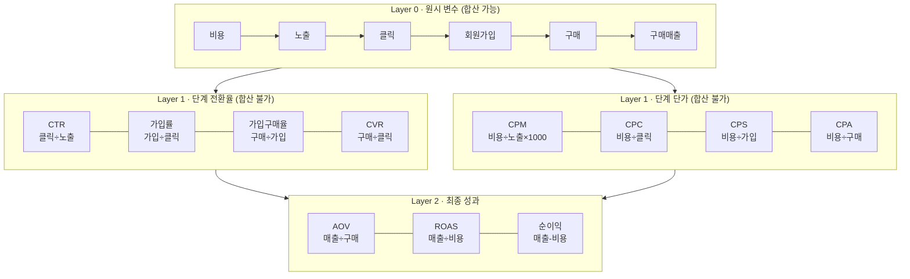

# 지표 체계 (Metrics Hierarchy)

이 폴더의 두 CSV(`*_channel.csv`, `*_appsflyer.csv`)로 만들 수 있는 지표를 계층과 분석 축으로
정리한다. 계산은 [marketing_data.py](marketing_data.py)의 `agg_by()`에 구현돼 있다.

모든 예시 수치는 **2025-01-01 실측 전체 합계**다.

---

## 1. 한눈에 보기



**읽는 순서**: Layer 0을 합산 → Layer 1을 재계산 → Layer 2로 판단.
거꾸로 가면(비율을 평균내면) 틀린다. §5 참조.

---

## 2. Layer 0 — 원시 변수

CSV에 그대로 있는 값. **더하기가 성립하는 유일한 층**이다.

| 변수 | 퍼널 단계 | 출처 | 비고 |
|---|---|---|---|
| `비용` | 투입 | channel | appsflyer엔 없음 |
| `노출` | 1 · 노출 | channel | appsflyer엔 없음 |
| `클릭` | 2 · 클릭 | 양쪽 | 조인 후 `클릭_channel` / `클릭_af`로 분리 |
| `회원가입` | 3 · 가입 | 양쪽 | 기여 로직이 달라 값이 다름 |
| `구매` | 4 · 구매 | 양쪽 | 〃 |
| `구매매출` | 5 · 매출 | 양쪽 | 〃 |

> **어느 쪽 값을 쓰나:** 대시보드는 `_channel`(매체 리포트)을 정본으로 쓴다.
> 네이버는 앱스플라이어 미연동이라 `_af`가 비어 있어서, `_af`를 쓰면 네이버가 통째로 0이 된다.

---

## 3. Layer 1 — 파생 지표

### 3-1. 단계 전환율 — "어디서 새는가"

| 지표 | 정의 | 2025-01-01 실측 | 떨어지면 의심할 것 |
|---|---|---|---|
| **CTR** | 클릭 ÷ 노출 | **2.76%** | 소재 피로도, 타겟 부적합 |
| **가입률** | 회원가입 ÷ 클릭 | **10.37%** | 랜딩페이지, 가입 폼 |
| **가입구매율** | 구매 ÷ 회원가입 | **35.88%** | 상품·가격·결제 흐름 |
| **CVR** | 구매 ÷ 클릭 | **3.72%** | 위 두 개의 곱 (= 10.37% × 35.88%) |

### 3-2. 단계 단가 — "얼마에 사는가"

| 지표 | 정의 | 2025-01-01 실측 |
|---|---|---|
| **CPM** | 비용 ÷ 노출 × 1000 | **₩5,309** |
| **CPC** | 비용 ÷ 클릭 | **₩192** |
| **CPS** | 비용 ÷ 회원가입 | **₩1,853** |
| **CPA** | 비용 ÷ 구매 | **₩5,163** |

---

## 4. Layer 2 — 최종 성과와 분해식

| 지표 | 정의 | 2025-01-01 실측 |
|---|---|---|
| **AOV** (객단가) | 구매매출 ÷ 구매 | **₩64,191** |
| **ROAS** | 구매매출 ÷ 비용 × 100 | **1,243.2%** |
| **순이익** | 구매매출 − 비용 | **₩104,184,598** (매체비만 차감) |

### 분해식 — ROAS가 떨어졌을 때 원인 찾는 경로

아래 세 항등식은 실측 데이터로 검증했다 (`eda_charts.py`와 동일한 조인 결과 기준).

```
① ROAS = AOV × CVR × CTR × (1000 ÷ CPM)
   1,243.2% = ₩64,191 × 3.72% × 2.76% × (1000 ÷ ₩5,309)   ✅

② ROAS = AOV ÷ CPA
   1,243.2% = ₩64,191 ÷ ₩5,163                            ✅

③ CPA  = CPC ÷ CVR
   ₩5,163 = ₩192 ÷ 3.72%                                  ✅
```

> **반올림 주의:** 위 검증은 **원시 합계**로 한 것이다. `agg_by()`가 표시용으로 반올림한
> 값을 손으로 곱하면 1,243.2% 대신 1,241.4%가 나온다 — 수식이 틀린 게 아니라 자릿수
> 때문이다. 드리프트가 1%를 넘지 않도록 `test_metrics.py`가 고정하고 있다.

**①이 실무에서 가장 쓸모 있다.** ROAS 하락을 4개 독립 인자로 쪼개주기 때문이다:

| 인자 | 하락하면 | 액션 주체 |
|---|---|---|
| AOV ↓ | 싼 상품만 팔림 | 상품·프로모션 |
| CVR ↓ | 유입은 되는데 안 삼 | 랜딩·상품 |
| CTR ↓ | 소재가 안 먹힘 | 크리에이티브 |
| CPM ↑ | 매체 단가 상승 | 입찰·매체 믹스 |

네 개 중 **어느 것이 얼마나 움직였는지** 보면 책임 소재가 갈린다. ROAS 하나만 보면
"메타가 안 좋다"까지밖에 못 간다.

---

## 5. ⚠️ 비율 지표는 절대 평균내지 말 것

가장 흔한 실수다. 실측으로 보여주면:

```
채널별 CTR 단순평균 : 3.94%
전체 재계산 CTR     : 2.76%     ← 43% 부풀려짐
```

노출이 압도적으로 많은 구글(1,116,892)과 적은 네이버(109,962)를 같은 무게로 평균냈기
때문이다. **반드시 원시 변수를 먼저 합산하고 비율을 다시 계산한다.**
`agg_by()`가 이 순서를 강제한다.

---

## 6. 분석 축 (디멘션)

### 계층 축 — 위에서 아래로 드릴다운

```
채널 (3)  →  캠페인 (9)  →  그룹 (5)  →  소재 (16)
구글/메타/네이버              논타겟/유사타겟/          VID·IMG·CRS·TXT
                             리마케팅/VIP/윈백
```

조인 키가 정확히 이 계층 + 날짜다: `일 + 캠페인 + 그룹 + 소재 + 채널`

### 부가 축 — 계층과 직교하게 자를 수 있는 것

| 축 | 값 | 출처 | 쓸모 |
|---|---|---|---|
| `채널분류` | 외부(구글·메타) / 자체(네이버) | channel | 매체비 성격 구분 |
| `캠페인목적` | 플러스가입, 리타겟팅, 첫구매, 신규유저, 룩얼라이크, 재구매, 브랜드KW, 일반KW (8) | channel | 목적별 ROAS 비교 |
| `소재타입` | VID / IMG / CRS / TXT (4) | 소재명 파싱 | 포맷별 효율 |
| `일` | 날짜 | 양쪽 | 추이 (현재 1일치) |

### 축 × 지표 조합 — 무엇을 어디에 쓰나

| 질문 | 축 | 볼 지표 |
|---|---|---|
| 어느 채널에 더 쓸까 | 채널 | ROAS, CPA, 순이익 |
| 어느 캠페인을 줄일까 | 채널 × 캠페인 | 비용 vs ROAS (사분면) |
| 어느 타겟이 잘 먹나 | 그룹 × 소재타입 | ROAS, CVR |
| 소재를 갈아야 하나 | 소재 | CTR, CPC |
| 랜딩이 문제인가 | 캠페인 | 가입률, 가입구매율 |
| 매체 단가가 올랐나 | 채널 × 일 | CPM, CPC |

---

## 7. 아직 확정 안 된 것

[CLAUDE.md](CLAUDE.md)의 미확정 항목과 연결된다. 지표를 **더 쪼개려면** 이게 먼저 필요하다.

1. **소재 네이밍 컨벤션** — 지금은 `소재타입`(첫 토큰)만 파싱한다. `{타입}_{테마}_{시즌}_{AB}_v{n}`
   가 확정되면 **테마별·시즌별·A/B 테스트별** 축이 추가로 생긴다. 지금 데이터에서
   `A`/`B` 접미사가 있는 소재와 없는 소재가 섞여 있어 규칙 없이는 파싱이 불가능하다.
2. **캠페인 코드 컨벤션** — `캠페인목적`은 이미 CSV에 별도 열로 있어서 파싱이 필요 없다.
   다만 유효한 목적 값의 전체 목록이 확정돼야 필터 UI에 하드코딩할 수 있다.
3. **순이익의 정의** — 현재는 `구매매출 − 매체비`다. 원가·수수료·배송비가 빠져 있어
   **실제 이익이 아니다.** 목표 ROAS 800%도 이 정의 위에서 정해진 값인지 확인 필요.
4. **어트리뷰션 기준** — `_channel`과 `_af`가 다른 값을 보고한다. 지금은 `_channel`을
   정본으로 쓰지만, 이게 팀 합의인지 확인이 필요하다.
